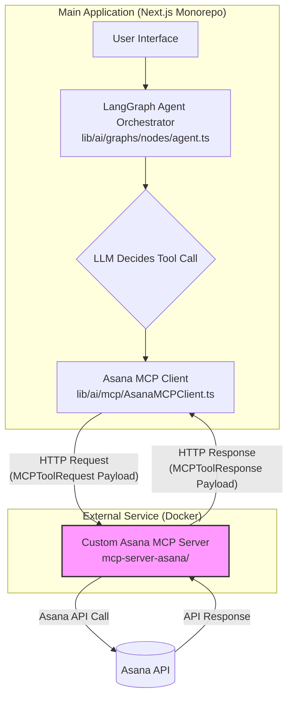

# Asana Integration Architecture: A Comprehensive Technical Overview

**Date:** June 21, 2025
**Status:** This document provides a detailed, developer-centric overview of the currently implemented Asana integration (v5.3.0). It should be considered the primary source of truth, superseding any previous planning documents.

## 1. Executive Summary

This document provides a comprehensive overview of the live Asana integration architecture for the Quibit RAG system. The integration leverages a **self-hosted Multi-Cloud Platform (MCP) server** and a **LangGraph-based agent** to provide natural language access to Asana functionalities.

The core of the architecture is a clear separation of concerns:
-   **Main Application (Next.js):** Hosts the user interface and the AI agent orchestrator.
-   **LangGraph Module (`lib/ai/graphs/`):** Orchestrates the AI's reasoning and tool-using capabilities.
-   **MCP Client (`lib/ai/mcp/`):** A client library within the main application for communicating with the external MCP server.
-   **Asana MCP Server (`mcp-server-asana/`):** A dedicated, containerized service that securely handles all interactions with the Asana API.

The intelligence for tool selection resides primarily within the Large Language Model (LLM), which is guided by detailed tool schemas and a carefully constructed system prompt.

---

## 2. System Architecture Diagram



---

## 3. The Lifecycle of a Tool Call

This section details the end-to-end process of how a user's natural language query is transformed into an Asana API call and back into a user-facing response.

### Step 1: Agent Reasoning & Tool Selection
-   **File of Interest:** `lib/ai/graphs/nodes/agent.ts`

The process begins when the `agent` node in the LangGraph is executed.
1.  **Prompt Assembly:** The orchestrator loads the user's query, the conversation history, and a list of available tool schemas from `lib/ai/tools/mcp/asana/index.ts`.
2.  **LLM Invocation:** This entire context is sent to the LLM. The LLM's task is to determine if the user's intent can be satisfied by one of the provided tools. It does this by semantically matching the user's query to the `description` field of a tool schema.
3.  **LLM Output:** If a match is found, the LLM's response will contain a structured tool call, specifying the `tool_name` and the `arguments` it has extracted from the query.

### Step 2: Tool Call Construction
-   **File of Interest:** `lib/ai/mcp/BaseMCPClient.ts`, `lib/ai/tools/mcp/asana/index.ts`

Before the request is sent to the MCP server, a standardized payload is constructed.
1.  **Tool Schema:** The available tools are defined with a strict schema. The quality of the `description` is paramount for accurate tool selection by the LLM.

    *Example Tool Schema from `lib/ai/tools/mcp/asana/index.ts`:*
    ```typescript
    {
      name: 'asana_search_tasks',
      description: 'Searches for tasks in Asana. Can be filtered by workspace, text, completion status, assignee, or project. Returns a list of tasks.',
      parameters: z.object({
        workspace: z.string().optional().describe('The GID of the workspace.'),
        text: z.string().optional().describe('The text to search for in task names and notes.'),
        // ... other parameters
      })
    }
    ```

2.  **Payload Definition:** The data sent to the MCP client is encapsulated in the `MCPToolRequest` object, defined in `lib/ai/mcp/BaseMCPClient.ts`. This provides a consistent structure for all tool calls.

    *`MCPToolRequest` Interface from `lib/ai/mcp/BaseMCPClient.ts`:*
    ```typescript
    export interface MCPToolRequest {
      arguments?: Record<string, any>;
      metadata?: Record<string, any>;
    }
    ```
    - `arguments`: Contains the parameters extracted by the LLM (e.g., `{ text: 'Review Q3 budget' }`).
    - `metadata`: A flexible field for passing extra application-level context, such as `userId` or `clientId`, which can be used for logging or server-side logic.

### Step 3: Client-Side Execution
-   **File of Interest:** `lib/ai/mcp/AsanaMCPClient.ts`

The `AsanaMCPClient` is responsible for transmitting the constructed payload to the MCP server.

1.  **`executeTool` Method:** This method takes the `toolName` and the `MCPToolRequest` object and handles the HTTP request.

    *Code Snippet from `lib/ai/mcp/AsanaMCPClient.ts`:*
    ```typescript
    async executeTool(
      toolName: string,
      args: MCPToolRequest = {},
    ): Promise<MCPToolResponse> {
      // For Asana, tools are under the /tools/asana/ path
      const response = await this.makeRequest(`/tools/asana/${toolName}`, {
        method: 'POST',
        headers: { 'Content-Type': 'application/json' },
        body: JSON.stringify(args), // The MCPToolRequest is serialized here
      });
      // ...
    }
    ```

### Step 4: Server-Side Execution
-   **Files of Interest:** `mcp-server-asana/src/http-server.ts`, `mcp-server-asana/src/asana-client-wrapper.ts`

The self-hosted MCP server receives the request and performs the final action.
1.  **Routing:** The Express server defined in `http-server.ts` routes the incoming request to the appropriate handler.
2.  **Logic Execution:** The route handler calls the relevant function in `asana-client-wrapper.ts`. This wrapper contains the core logic for interacting with the official Asana Node.js client library. It uses the stored credentials to make the final, authenticated API call to Asana.

---

## 4. Security & Configuration
-   **Authentication:** User authentication with Asana is handled via an OAuth 2.0 flow managed by routes in `app/api/integrations/asana/`. Access tokens are encrypted and stored in the database.
-   **Secure Proxy Model:** The main application **does not** have direct access to Asana API credentials. The Asana MCP Server acts as a secure proxy, isolating the Asana client and credentials from the main application.
-   **Environment Variables:**
    -   `ASANA_MCP_SERVER_URL`: The URL for the self-hosted Asana MCP server, used by the `AsanaMCPClient`.
    -   `ASANA_ACCESS_TOKEN`: The service account or master access token, used exclusively by the `mcp-server-asana` service to interact with the Asana API.

This document provides a faithful and detailed representation of the system's current state, designed to serve as a key technical reference for the development team. 