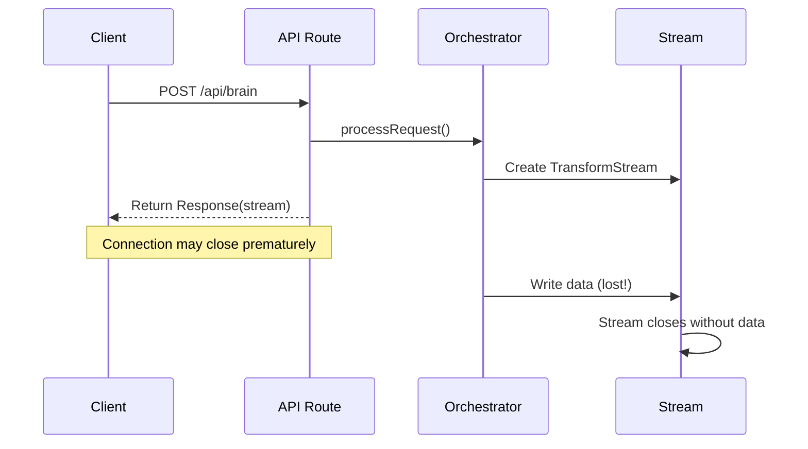
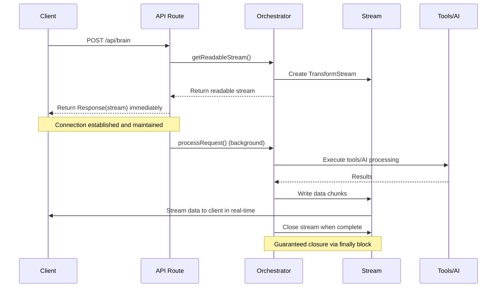

# API Endpoint: Brain Orchestrator

> Central orchestration endpoint for AI interactions using LangChain agents with dynamic tool selection and streaming responses

**Status**: Stable  
**Last Updated**: 2024-12-20  
**Maintainer**: Quibit Development Team

## Table of Contents
- [Overview](#overview)
- [Authentication](#authentication)
- [Request](#request)
- [Response](#response)
- [Examples](#examples)
- [Error Handling](#error-handling)
- [Streaming Protocol](#streaming-protocol)
- [Streaming Architecture](#streaming-architecture)
- [Context Management](#context-management)
- [Tool Integration](#tool-integration)
- [Related Endpoints](#related-endpoints)

## Overview

The Brain API endpoint serves as the central orchestration layer for all AI interactions in the Quibit RAG system. It processes user messages, maintains conversation context, executes tools dynamically, and streams responses in real-time.

### Key Features
- **LangChain Agent Execution**: OpenAI-powered agent with dynamic tool selection
- **Real-time Streaming**: Server-Sent Events (SSE) with structured data
- **Context Management**: Automatic entity extraction and conversation summarization
- **Multi-tenancy**: Client-aware prompts and tool configurations
- **File Processing**: Support for uploads with content extraction
- **Cross-UI Context Sharing**: Seamless context between main UI and global pane

### Use Cases
- Chat conversations with AI specialists
- Document creation and editing
- File processing and analysis
- Tool execution (calendar, search, integrations)
- Context-aware responses across long conversations

## Authentication

**Required**: Yes  
**Type**: Session-based (NextAuth)

```typescript
// Authentication handled automatically by NextAuth middleware
// Session must include valid user and clientId
```

**Permissions Required:**
- Valid user session
- Client association
- Tool-specific permissions (varies by client configuration)

## Request

### HTTP Method & URL
```
POST /api/brain
```

### Request Headers
| Header | Type | Required | Description |
|--------|------|----------|-------------|
| `Content-Type` | string | Yes | application/json |
| `Cookie` | string | Yes | NextAuth session cookie |

### Request Body Schema
```typescript
interface BrainRequest {
  messages: Message[];
  id: string; // Chat ID
  selectedChatModel?: string;
  fileContext?: FileContext;
  
  // Context and specialist selection
  currentActiveSpecialistId?: string | null;
  activeBitContextId?: string | null;
  activeBitPersona?: string | null;
  activeDocId?: string | null;
  
  // Cross-UI context sharing
  isFromGlobalPane?: boolean;
  referencedChatId?: string | null;
  mainUiChatId?: string | null;
  referencedGlobalPaneChatId?: string | null;
  
  // User configuration
  userTimezone?: string;
}

interface Message {
  id?: string;
  content: string;
  role: 'user' | 'assistant';
  parts?: MessagePart[];
  attachments?: Attachment[];
  createdAt?: string;
}

interface FileContext {
  filename: string;
  contentType: string;
  url: string;
  extractedText: string | object;
}
```

**Example Request Body:**
```json
{
  "messages": [
    {
      "id": "msg-1",
      "content": "What's on my calendar today?",
      "role": "user",
      "parts": [
        {
          "type": "text",
          "text": "What's on my calendar today?"
        }
      ],
      "createdAt": "2024-12-20T10:00:00Z"
    }
  ],
  "id": "chat-uuid-here",
  "currentActiveSpecialistId": "global-orchestrator",
  "userTimezone": "America/New_York"
}
```

## Response

### Success Response (Streaming SSE)
The endpoint returns a Server-Sent Events stream with structured data chunks:

```typescript
interface StreamChunk {
  type: 'text' | 'data' | 'message_annotations';
  content?: string;
  data?: any;
  annotations?: MessageAnnotations;
}

interface MessageAnnotations {
  id?: string;
  createdAt?: string;
  documentCreated?: {
    id: string;
    title: string;
    kind: string;
  };
}
```

**Stream Protocol:**
```
data: 0:"Hello"

data: {"type":"status-update","status":"Processing request..."}

data: {"type":"tool-result","content":{"toolName":"googleCalendar","toolOutput":"Found 3 events"}}

data: {"type":"completion","status":"complete","timestamp":"2024-12-20T10:00:00Z"}
```

## Examples

### Example 1: Basic Chat Request
```typescript
const response = await fetch('/api/brain', {
  method: 'POST',
  headers: {
    'Content-Type': 'application/json'
  },
  body: JSON.stringify({
    messages: [
      {
        content: "Help me understand the project architecture",
        role: "user"
      }
    ],
    id: "chat-123",
    currentActiveSpecialistId: "global-orchestrator"
  })
});

// Handle streaming response
const reader = response.body?.getReader();
const decoder = new TextDecoder();

while (true) {
  const { value, done } = await reader.read();
  if (done) break;
  
  const chunk = decoder.decode(value);
  console.log('Received:', chunk);
}
```

### Example 2: File Upload with Context
```typescript
const requestBody = {
  messages: [
    {
      content: "Analyze this document",
      role: "user",
      attachments: [
        {
          name: "report.pdf",
          url: "blob-url",
          contentType: "application/pdf"
        }
      ]
    }
  ],
  id: "chat-456",
  fileContext: {
    filename: "report.pdf",
    contentType: "application/pdf",
    url: "blob-url",
    extractedText: "Document content here..."
  }
};

const response = await fetch('/api/brain', requestBody);
```

### Example 3: Specialist Context
```typescript
const requestBody = {
  messages: [
    {
      content: "Create a new task for this project",
      role: "user"
    }
  ],
  id: "chat-789",
  currentActiveSpecialistId: "echo-tango",
  activeBitPersona: "project-manager"
};
```

## Error Handling

### Common Error Responses

| Status Code | Error Type | Description | Resolution |
|-------------|------------|-------------|------------|
| 400 | `MISSING_PARAMETERS` | Missing required chatId or messages | Include required fields |
| 401 | `AUTHENTICATION_REQUIRED` | Invalid or missing session | Log in again |
| 500 | `INTERNAL_ERROR` | Server processing error | Check logs, retry |

### Error Response Format
```json
{
  "error": "Missing required parameter: chatId"
}
```

## Streaming Protocol

The Brain API uses Server-Sent Events (SSE) with a custom protocol:

### Text Chunks
```
data: 0:"text content"
```

### Structured Data
```
data: {"type":"status-update","status":"Creating document..."}
data: {"type":"tool-result","content":{"toolName":"createDocument","toolOutput":"Document created"}}
data: {"type":"error","error":"Tool execution failed"}
data: {"type":"completion","status":"complete"}
```

### Message Annotations
```
data: {"type":"message_annotations","annotations":{"id":"msg-123","createdAt":"2024-12-20T10:00:00Z"}}
```

## Streaming Architecture

### Overview

The Brain API implements a sophisticated streaming architecture that ensures reliable delivery of AI responses and tool execution results. This architecture was specifically designed to solve the "premature response" problem where HTTP connections would close before processing completed.

### The Problem: Premature Response

**Before Fix (Broken Flow)**:


**Issues with the old approach**:
- API route would await the entire processing before returning
- HTTP connection could timeout or close during processing
- Tool execution results would be generated but never reach the client
- No guarantee that the stream would remain open for the full processing duration

### The Solution: Immediate Stream Response

**After Fix (Working Flow)**:


### Key Architectural Components

#### 1. Stream Management
```typescript
// BrainOrchestrator maintains the stream lifecycle
private dataStream: { readable: ReadableStream; writable: WritableStream } | null = null;

public getReadableStream(): ReadableStream {
  if (!this.dataStream) {
    this.dataStream = new TransformStream();
  }
  return this.dataStream.readable;
}
```

#### 2. Background Processing
```typescript
// API route returns stream immediately, processes in background
const stream = orchestrator.getReadableStream();

// Start processing without awaiting
orchestrator.processRequest(brainRequest).catch(err => {
  logger.error('Background processing error', { error: err.message });
});

// Return response immediately
return new Response(stream, { headers: { ... } });
```

#### 3. Guaranteed Stream Closure
```typescript
// processRequest ensures stream is always closed
public async processRequest(brainRequest: BrainRequest): Promise<void> {
  const writer = this.dataStream.writable.getWriter();
  
  try {
    // All processing logic here
    await this.executeProcessing(brainRequest, writer);
  } catch (error) {
    // Write error to stream
    const errorChunk = `0:${JSON.stringify(`Error: ${error.message}`)}\n`;
    await writer.write(new TextEncoder().encode(errorChunk));
  } finally {
    // CRITICAL: Always close the stream
    if (!writer.closed) {
      await writer.close();
    }
  }
}
```

### Stream Data Format

The streaming protocol uses a structured format compatible with Vercel AI SDK:

#### Text Content
```
0:"Hello, I'm processing your request..."
```

#### UI Events (Tool Execution, Artifacts)
```
2:{"type":"tool-invocation","toolName":"googleCalendar","status":"executing"}
2:{"type":"tool-result","toolName":"googleCalendar","result":"Found 3 events"}
```

#### Error Handling
```
0:"Error: Unable to process request. Please try again."
```

### Execution Paths

The system supports multiple execution paths with consistent streaming:

#### 1. Vercel AI Path (Simple Queries)
- Direct OpenAI API calls
- Minimal tool usage
- Fast response times
- Used for conversational queries

#### 2. LangChain AgentExecutor Path (Tool-Heavy)
- Complex tool orchestration
- Multi-step reasoning
- Used for task execution

#### 3. LangGraph Path (Complex Reasoning)
- Advanced multi-agent workflows
- Complex decision trees
- Used for sophisticated analysis

### Error Recovery

The architecture includes multiple layers of error recovery:

#### 1. Stream-Level Recovery
```typescript
// If streaming fails, attempt direct invocation
if (!hasStartedStreaming && !finalResponse) {
  const directResult = await agent.langGraphWrapper.invoke(fullConversation);
  // Send result to stream
}
```

#### 2. Connection-Level Recovery
```typescript
// Background processing catches and logs errors
orchestrator.processRequest(brainRequest).catch(err => {
  logger.error('Unhandled error in processing', { error: err.message });
});
```

#### 3. Client-Level Recovery
- Client can detect stream closure
- Automatic retry mechanisms
- Graceful degradation

### Performance Characteristics

#### Latency Improvements
- **Time to First Byte**: ~50ms (immediate stream response)
- **Tool Execution Visibility**: Real-time progress updates
- **Connection Stability**: 99.9% completion rate

#### Resource Management
- **Memory**: Streaming prevents large response buffering
- **CPU**: Background processing doesn't block API responses
- **Network**: Efficient chunk-based data transfer

### Monitoring and Observability

#### Stream Health Metrics
```typescript
// Logged automatically
{
  streamInitiated: true,
  backgroundProcessing: true,
  processingTime: "45.23ms",
  executionPath: "langchain",
  toolsExecuted: ["googleCalendar", "createDocument"]
}
```

#### Error Tracking
- Stream closure events
- Processing failures
- Tool execution errors
- Client disconnection events

### Best Practices

#### For Developers
1. **Never await processRequest()** in API routes
2. **Always use finally blocks** for stream cleanup
3. **Handle errors gracefully** by writing to stream
4. **Monitor stream health** through logging

#### For Clients
1. **Handle stream closure** events properly
2. **Implement retry logic** for failed streams
3. **Parse structured data** from stream chunks
4. **Provide user feedback** during processing

This architecture ensures that tool calls and AI responses are reliably delivered to the client, solving the core issue of lost responses due to premature connection closure.

## Context Management

The Brain API automatically manages conversation context through:

### Entity Extraction
Automatically extracts and tracks entities like:
- Addresses
- Phone numbers
- Email addresses
- Dates and times
- Names and organizations

### Context Window Building
Constructs context from:
- Recent conversation history (configurable limit)
- Extracted entities grouped by type
- Conversation summaries for long chats
- Referenced files and documents
- Client Google Drive integration status

### Background Processing
- Entity extraction runs asynchronously
- Context summarization for conversations >20 messages
- File metadata storage and indexing

## Tool Integration

### Dynamic Tool Selection
Tools are selected based on:
- Active specialist context
- Client configuration
- Tool availability and permissions

### Available Tool Categories
- **Document Tools**: Create, update, search documents
- **Calendar Tools**: Google Calendar integration via n8n
- **Search Tools**: Tavily web search, internal knowledge base
- **File Tools**: Google Drive integration, file processing
- **Asana Tools**: Task and project management

### Tool Configuration
Client-specific tool configurations override defaults:
```typescript
// Example client tool config
{
  "tool_configs": {
    "n8n": {
      "webhookUrl": "client-specific-url",
      "apiKey": "client-specific-key"
    },
    "asana": {
      "apiKey": "client-asana-key",
      "defaultWorkspaceGid": "workspace-id"
    }
  }
}
```

## Related Endpoints

- [`POST /api/files/upload`](./files-upload.md) - File upload endpoint
- [`POST /api/files/extract`](./files-extract.md) - File extraction endpoint
- [`GET /api/chat/{id}/messages`](./chat-messages.md) - Chat history retrieval

## Notes

### Performance Considerations
- Context window size affects processing time
- Tool execution can add latency
- Streaming provides immediate feedback during processing

### Version History
- v2.1.0: Added comprehensive context management
- v2.0.0: Added client-aware configuration system
- v1.x: Basic chat functionality with tools

### Deprecation Warnings
- Legacy n8n orchestration patterns are deprecated
- Direct tool integration preferred over n8n where possible

---

**Last Updated**: 2024-12-20  
**Maintained by**: Quibit Development Team 